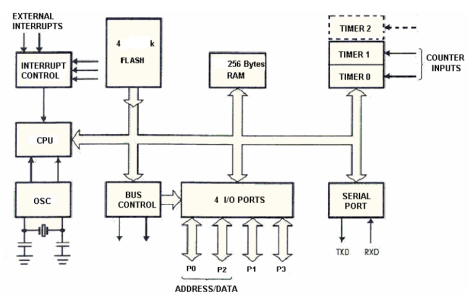

Atividade Semanal 2
SEL0614 - Aplicação de Microprocessadores (2024)

Discentes: 
Marcelo Eduardo Reginato
Rhayna Christiani Vasconcelos Marques Casado

Docente: Pedro Oliveira
Data: 14/08/2024

Questão 3
# Recorra ao exemplo do microcontrolador aplicado ao controle de um elevador que foi apresentado em aula, disponível nas transparências do Cap. 1. De acordo com seu ponto de vista, quais as vantagens de se utilizar um microcontrolador para aquele tipo de aplicação e qual deve ser o “perfil” de um microcontrolador ideal para aquela aplicação do elevador em termos de capacidade da CPU (baixa, média ou alta), quantidade de bits no barramento, e precisão no tratamento das informações (operação somente com inteiros ou ponto flutuante?)

Questão 4
# Quanto às portas paralelas de um microcontrolador:
( ) São somente de entrada.
( ) São somente de saída.
( ) Cada palavra (A, B, C, P1, P2, P3…) pode ser configurada como entrada ou saída.
( ) Cada bit pode ser configurado como entrada ou saída.
( ) Cada palavra (A, B, C... P1, P2, P3…) pode ser configurada como entrada, saída ou
bidirecional.
( ) Cada bit pode ser configurado como entrada, saída ou bidirecional.

Questão 5
# Assinale V para verdadeiro e F para falso nas afirmações abaixo:
( ) No modelo de Von Neumann, o microprocessador segue as instruções armazenadas na
memória ROM (programas), lê as entradas e envia comandos sobre os canais de saída,
alterando as informações contidas na memória RAM.
( ) Os registradores Special Function Registers localizam-se sempre internos à CPU.
( ) O ciclo de máquina é composto pelo ciclo de busca mais o ciclo de execução, cada
qual demorando um pulso de clock.
( ) A instrução “CLR A” não possui operando e gasta apenas 1 ciclo de máquina
( ) A arquitetura Von Neumann é considerada uma arquitetura mais simples do que a
arquitetura Harvard porque utiliza o mesmo barramento para o tráfego de dados e de
instruções.
( ) A técnica de pipeline é impossível de ser utilizada em computadores de arquitetura
Von Neumann.

Questão 6
# Indique quais afirmativas se aplicam a uma instrução CISC e quais a uma instrução RISC:
➔ Os programas são mais complexos
➔ A maioria das instruções tem a mesma duração
➔ Mais instruções disponíveis
➔ Programas menores
➔ Utiliza menos espaço na memória de programa
➔ Processamento de cada instrução é mais lento
➔ Microcontroladores PIC, AVR, ARM
➔ Tempo de execução das instruções depende da frequência do clock.

Questão 7
# Abaixo é apresentado o diagrama de um microcontrolador. Qual a arquitetura utilizada e como chegamos a essa conclusão? Quantas portas I/O bidirecional e quantas linhas (bits/pinos) são endereçados de forma individual neste microcontrolador, com base neste diagrama?

